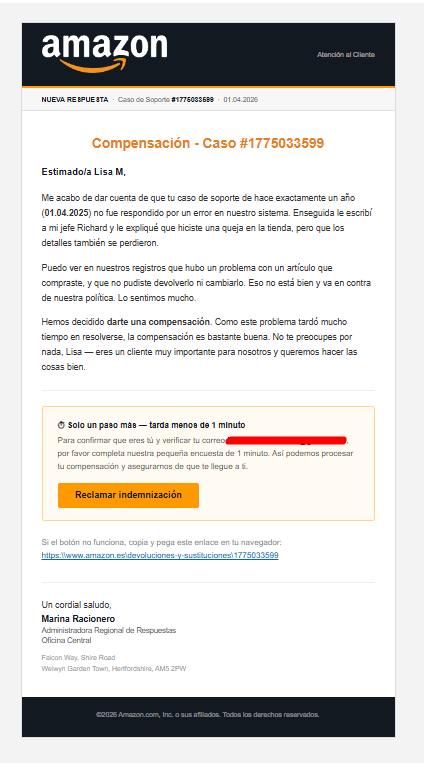
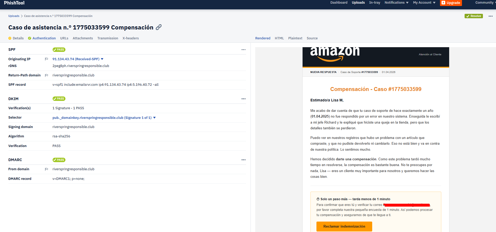
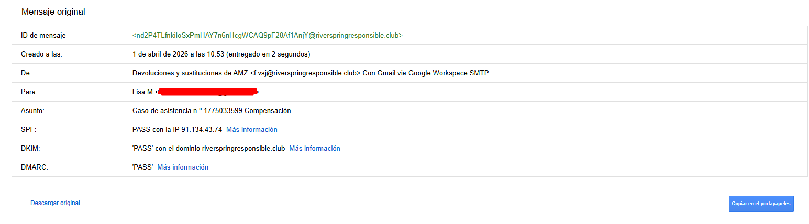
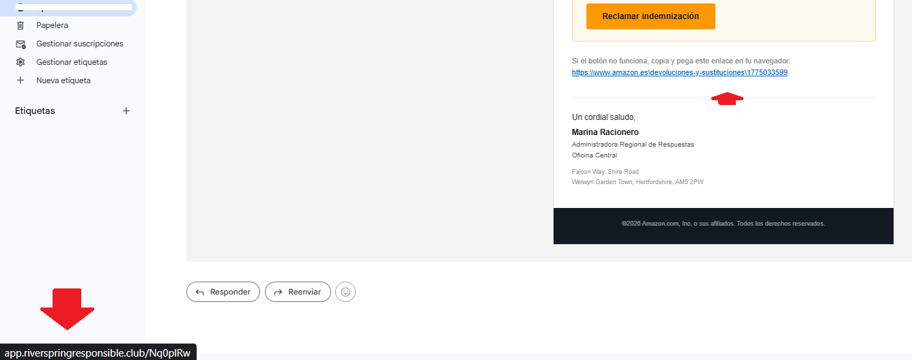
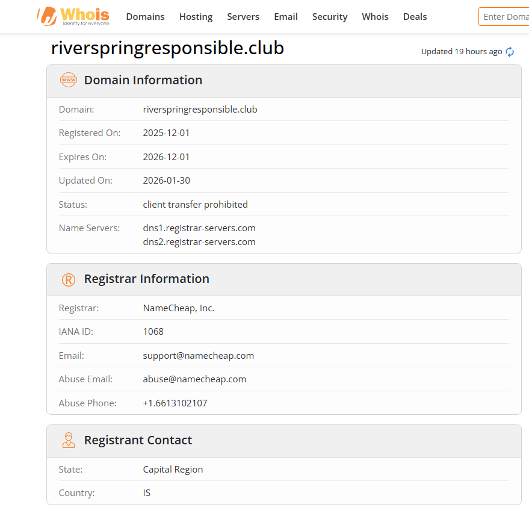
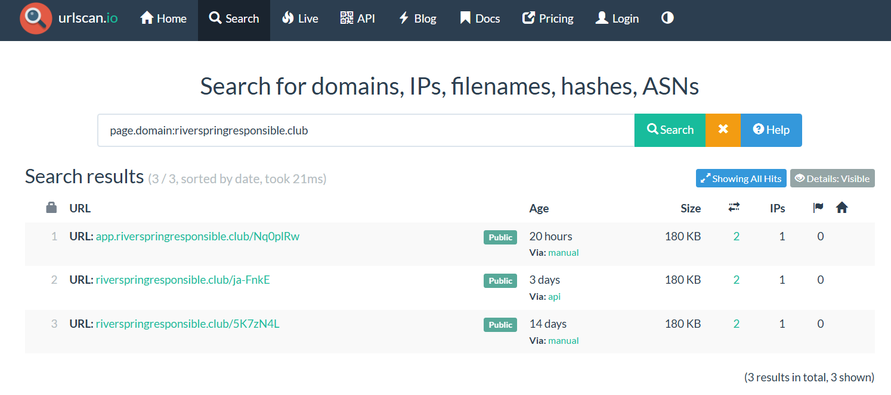

# Real-Phishing-Analysis-Amazon-ES
Análisis de un phishing real que recibí. 

# 🎣 Análisis Técnico: Phishing de Amazon ES que evadió SPF/DKIM/DMARC

**Autor:** Lisa Moreno  
**Fecha:** Abril 2026  
**Herramientas:** PhishTool, URLScan.io, WHOIS (ICANN), Google Admin Toolbox  
**Nivel:** Intermedio / SOC Analyst Case Study

---

## 📌 Resumen ejecutivo
El 1 de abril de 2026 recibí un email que suplantaba a Amazon España. A diferencia del phishing típico, este pasó **SPF, DKIM y DMARC** — los tres controles de autenticación de email. Este writeup documenta el análisis técnico completo: cabeceras, dominio, infraestructura de ataque y técnicas de evasión empleadas.

⚠️ *Aviso: Todos los datos personales han sido anonimizados. Las URLs maliciosas no están activas. Este análisis es únicamente con fines educativos.*

---

## 1. 📧 El email — primera impresión
| Campo | Valor |
| :--- | :--- |
| **De (visible)** | Devoluciones y sustituciones de AMZ |
| **Dirección remitente** | `f.vsj@riverspringresponsible.club` |
| **Asunto** | Caso de asistencia n.º 1775033599 Compensación (con caracteres ocultos) |
| **Servidor envío** | `2peg8ph.riverspringresponsible.club` (IP: 91.134.43.74) |

El email estaba diseñado para parecer una comunicación oficial de Amazon: colores corporativos, logo real, franja naranja característica y estructura de ticket de soporte.

---

## 2. 🔐 Autenticación — el hallazgo más llamativo
* **SPF:** PASS ✅ (IP 91.134.43.74 autorizada por `riverspringresponsible.club`)
* **DKIM:** PASS ✅ (firma válida para el dominio del atacante)
* **DMARC:** PASS ✅ (política: NONE)

**¿Por qué pasan los tres si es phishing?**
Porque SPF, DKIM y DMARC solo verifican que el email viene del dominio que dice ser técnicamente. El atacante registró su propio dominio, configuró los registros DNS correctamente y envió el email desde su infraestructura. **Autenticado no significa legítimo.**

---

## 3. 🎭 Técnicas de evasión — capa a capa

### 3.1 Zero-Width Characters en el asunto
El asunto utiliza caracteres Unicode de ancho cero (invisibles) para fragmentar las palabras. Esto rompe la detección de filtros basados en palabras clave como "Compensación".

### 3.2 Homoglyph Attack
Se utiliza el carácter **U+1D0F** (Latin Letter Small Capital O) en lugar de una "o" latina en la palabra `amazᴏn`. Es visualmente idéntico pero técnicamente distinto.

### 3.3 Ofuscación de URL (Barras Invertidas)
El enlace visible emplea barras invertidas: `https:\\www.amazᴏn.es\...`. 
* **Evasión:** Engaña a filtros que buscan la cadena exacta `://`.
* **Funcionalidad:** Los navegadores modernos normalizan automáticamente las `\\` a `/ /` al procesar el clic.

---

## 4. 🌐 Análisis de infraestructura

### 4.1 El dominio: riverspringresponsible.club
* **Registrado:** 2025-12-01 (4 meses antes del ataque para ganar reputación).
* **Privacidad:** Uso de Withheld for Privacy ehf (Islandia) para ocultar al atacante.

### 4.2 Campaña activa (URLScan.io)
Se detectaron escaneos manuales y vía API en **España, EE.UU. y Bélgica**, lo que indica una campaña distribuida geográficamente.

---

## 5. 🗺️ MITRE ATT&CK Mapping
| Técnica | ID | Descripción |
| :--- | :--- | :--- |
| **Phishing** | T1566.002 | Spearphishing con enlace malicioso. |
| **Obfuscated Info** | T1027 | Zero-width characters y Homógrafos. |
| **Masquerading** | T1036 | Suplantación visual de Amazon. |
| **Acquire Infra** | T1583.001 | Dominio registrado con antelación. |

---

## 6. 🔴 Indicadores de Compromiso (IOCs)
* **Dominio:** `riverspringresponsible.club`
* **IP:** `91.134.43.74`
* **URL:** `http://app.riverspringresponsible.club/Nq0plRw`

---

## 7. ✅ Conclusiones
Este caso demuestra que confiar solo en el "check" verde de autenticación es un riesgo. Las señales críticas de alerta fueron el dominio remitente ajeno a la marca, la discrepancia en la URL al hacer hover y el uso de caracteres inusuales.

---

## 🛠️ Herramientas utilizadas
* [PhishTool](https://phishtool.com) - Análisis de cabeceras.
* [URLScan.io](https://urlscan.io) - Análisis de infraestructura.
* [ICANN WHOIS](https://lookup.icann.org) - Registro de dominios.

**Análisis realizado por Lisa Moreno** [lisamorenoit.github.io](https://lisamorenoit.github.io)
